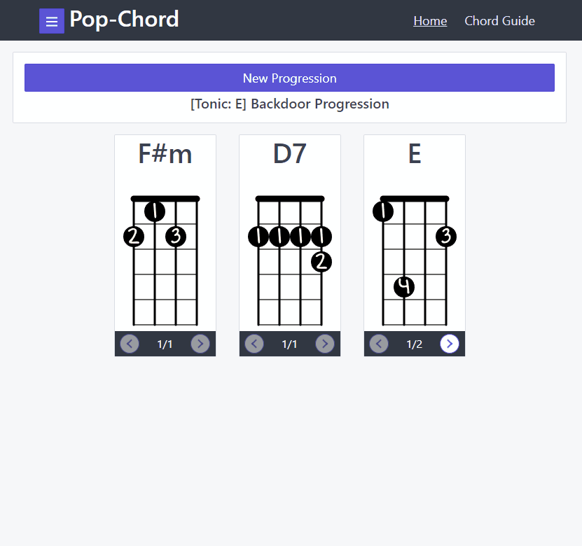
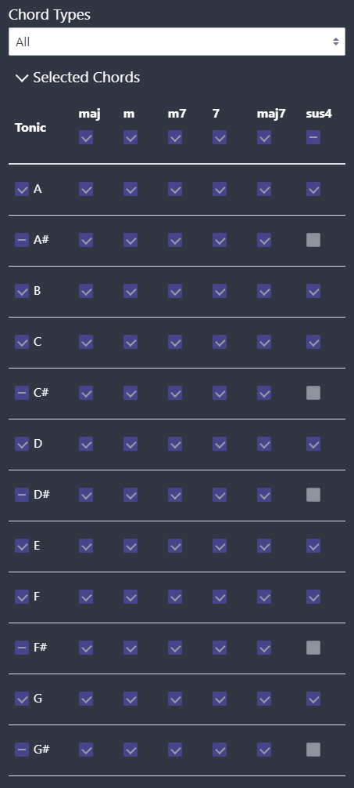
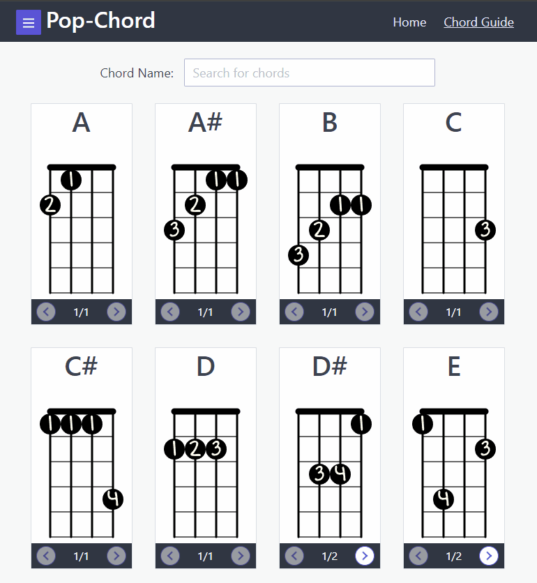

# Pop-Chord

Generate a myriad of Ukulele chord progressions instantly with this tool, with their corresponding fingering patterns.

Try it out [here](https://eatmygoose.github.io/Pop-Chord/index.html)

## Chord Selection Customization

Control the level of difficulty of the generated chord progression by choosing exactly which chords can be used.

Presets include:
- Basic Chords (Common chords without major stretches)
- All 
- Custom Selection (Pick and omit chords as you wish)

## Chord Progression Templates

Pop-Chord generates chord progressions from a known bank of Chord Progressions, full control is given over which progressions can or cannot be used.

## Generation Strategies

Pop-Chord has two chord progression generation modes:
- Default
  - Chords Progressions are selected at random 
- Favour Unseen Chords
  - Chord Progressions which contain as-of-yet unused chords are favoured

## Chord Fingering Reference

A built in chord fingering guide is provided under the "Chord Guide" tab.

